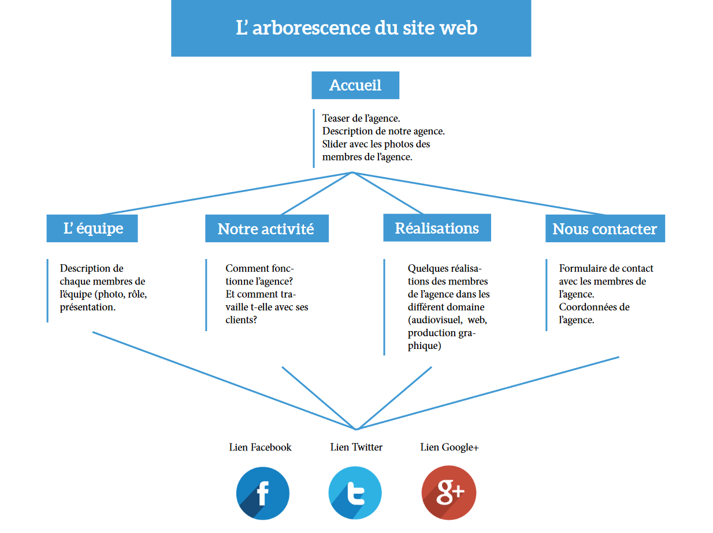
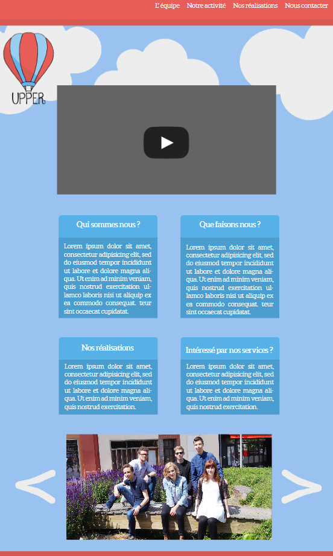
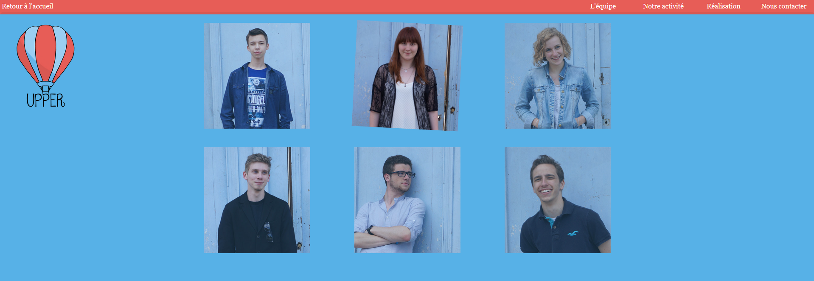
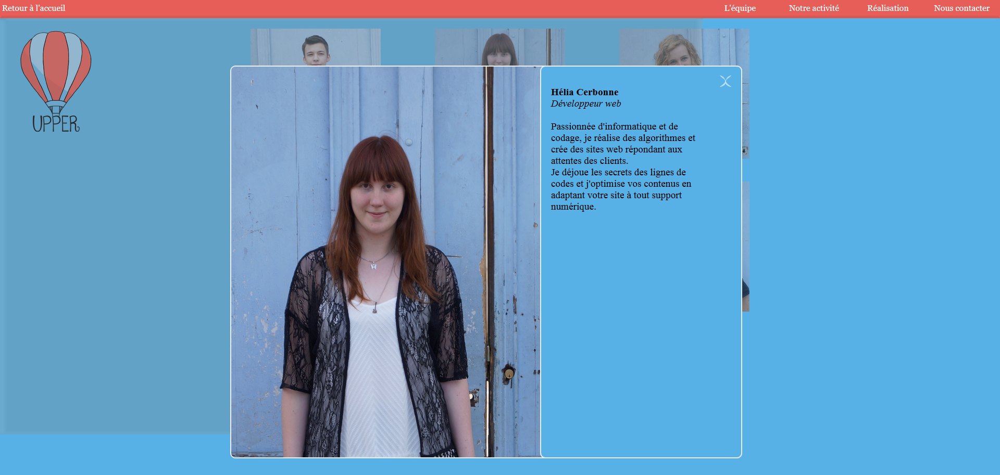

# Upper
Projet étudiant pour l'IUT d'Elbeuf. Site web pour l'agence de communication fictive Upper.

Je ne garantis pas à 100% le fonctionnement de ce projet, car un peu ancien. 
Réalisé en juin 2015 par mes camarades de l'IUT d'Elbeuf et moi même.

## Installation : 
- Utiliser un serveur local (wamp, easyphp, xampp etc)
- Lancer index.html
- Enjoy !

## Quelques screens

